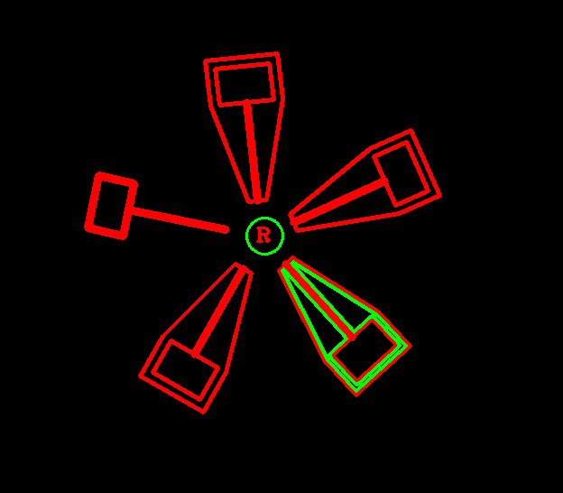
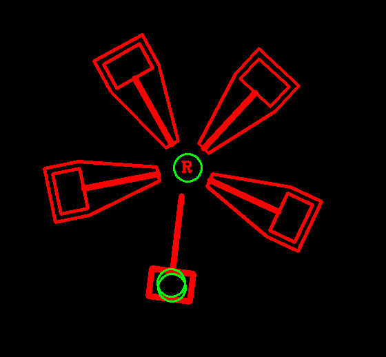
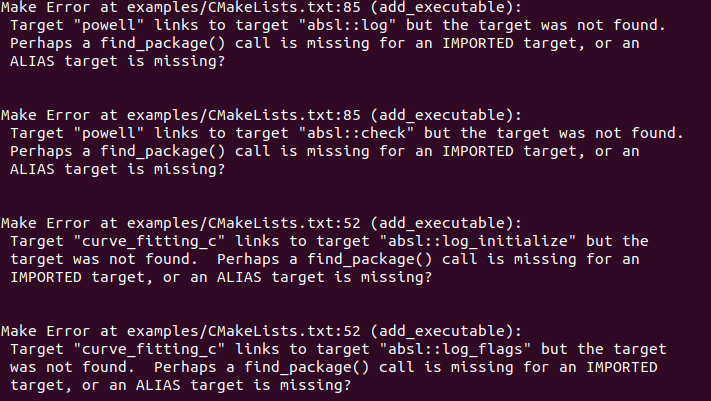
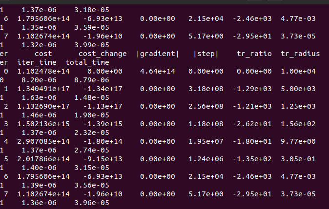
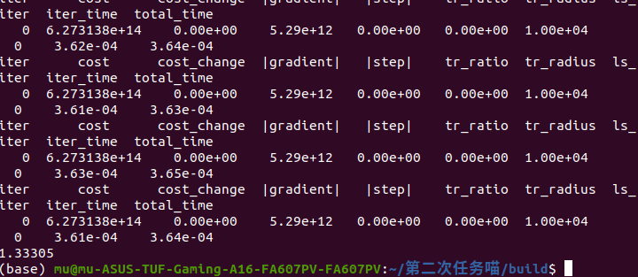

# 能量装置的识别 
由于R标保持竖直，对R标的识别通过文件直接在src上对照识别；
 
考虑到总体图形中一共有多个锤形，在识别锤形时对blur后的图形，计算边长后取近似为七边形的图形为目标图形。框选识别了图形。但是无法在图形的中心画圆。
;
尝试使用drawcontours在特定的轮廓上draw，但是每一帧，数值在改变，不稳定而且无法实现
；
在第一次的方法上调整数值
；

## 用ceres对运动进行拟合 
安装ceres库时报错

在安装对应版本的eigen后解决；
根据报错不断修改；
无法收敛；
；
逐步收敛
增加了最大迭代字数后最终拟合
;
